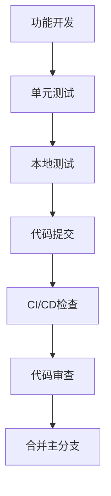

# 代码审查和测试计划

## 项目概述

**项目名称**: 生活工具集 (Life Tools)
**技术栈**: Next.js 16 + React 19 + Tailwind CSS
**应用类型**: 投资分析工具和生活助手集合
**主要功能**: KDJ/RSI技术分析、网格策略、做T计算器、豆浆预约等

## 代码质量分析

### 现状评估

#### ✅ 优势
- **现代化架构**: 使用Next.js App Router，React 19最新特性
- **组件化设计**: 良好的UI组件复用和封装
- **响应式设计**: 移动端优化和iOS风格设计
- **类型安全**: 使用ESLint进行代码质量检查
- **数据持久化**: LocalStorage实现用户数据缓存

#### ⚠️ 需要改进的问题
1. **错误处理不完善**: 多处使用console.error但缺乏用户友好的错误提示
2. **输入验证有限**: 只有基础的数值范围验证
3. **缺乏测试**: 无单元测试、集成测试���端到端测试
4. **性能优化**: 大量动画和背景效果可能影响性能
5. **无障碍性**: 缺乏ARIA标签和键盘导航支持
6. **国际化**: 硬编码中文内容，缺乏多语言支持

## 代码审查标准

### 1. 代码质量检查清单

#### 基础规范
- [ ] ESLint检查无错误和警告
- [ ] 组件命名遵循PascalCase
- [ ] 文件命名遵循kebab-case或camelCase
- [ ] 函数和变量使用有意义的名称
- [ ] 每个函数不超过50行（复杂逻辑除外）
- [ ] 避免使用var，使用const/let

#### React/Next.js最佳实践
- [ ] 组件使用'use client'指令（客户端组件）
- [ ] 正确使用React Hooks（useState, useEffect等）
- [ ] 避免在render中创建新函数
- [ ] 使用memo优化重渲染
- [ ] 正确处理异步操作和loading状态
- [ ] 避免直接修改state

#### 错误处理和验证
- [ ] 所有用户输入都有验证
- [ ] 网络请求有错误处理
- [ ] 提供用户友好的错误信息
- [ ] 实现降级方案（graceful degradation）
- [ ] 关键操作有确认机制

#### 性能优化
- [ ] 图片使用Next.js Image组件
- [ ] 避免不必要的重渲染
- [ ] 合理使用useCallback和useMemo
- [ ] 大数据集使用虚拟化
- [ ] 懒加载非关键资源

#### 安全性
- [ ] 输��数据清理和验证
- [ ] 避免XSS攻击
- [ ] 敏感数据不在localStorage存储
- [ ] API请求有适当验证
- [ ] CSP策略配置

#### 可访问性
- [ ] 语义化HTML标签
- [ ] 图片有alt属性
- [ ] 表单元素有label
- [ ] 支持键盘导航
- [ ] 色彩对比度符合WCAG标准
- [ ] ARIA标签正确使用

### 2. 审查流程

#### 提交前审查
1. **自检清单**
   - 运行`npm run lint`确保无警告
   - 测试核心功能流程
   - 检查移动端兼容性
   - 验证暗色模式正常工作

#### 同行审查
1. **代码审查重点**
   - 业务逻辑正确性
   - 代码可读性和维护性
   - 性能影响评估
   - 安全风险识别

#### 审查工具
- **ESLint**: 代码质量检查
- **Prettier**: 代码格式化（建议添加）
- **TypeScript**: 类型检查（建议迁移）
- **Lighthouse**: 性能和可访问性评估

## 测试策略和计划

### 1. 测试金字塔

```
        E2E Tests
         少量
    /            \
Integration Tests
    中等数量
/                  \
Unit Tests
大量
```

### 2. 测试类型和范围

#### 单元测试 (Unit Tests)
**目标覆盖率**: 80%+

**测试范围**:
- [ ] `src/lib/calculations.js` - 核心金融计算逻辑
- [ ] `src/lib/validations.js` - 输入验证函数
- [ ] `src/hooks/useLocalStorage.js` - 自定义Hook
- [ ] `src/lib/utils.js` - 工具函数
- [ ] UI组件的渲染和交互逻辑

**测试框架**: Jest + React Testing Library

#### 集成测试 (Integration Tests)
**测试范围**:
- [ ] 完整的用户操作流程（输入→计算→结果展示）
- [ ] LocalStorage数据持久化
- [ ] 主题切换功能
- [ ] 响应式布局在不同设备的表现
- [ ] 页面路由导航

#### 端到端测试 (E2E Tests)
**测试框架**: Playwright 或 Cypress

**关键用户场景**:
1. **KDJ+RSI分析流程**
   - 访问首页 → 点击KDJ+RSI → 输入参数 → 查看结果
2. **做T计算器**
   - 输入买入价格 → 输入卖出价格 → 计算成本和收益
3. **网格策略分析**
   - 设置网格参数 → 查看策略建议
4. **移动端体验**
   - 在移动设备尺寸下的完整操作流程
5. **主题切换**
   - 切换暗色/亮色主题并验证显示效果

### 3. 测试实施计划

#### 阶段一：测试环境搭建 (1-2天)
1. 安装测试依赖：
   ```bash
   npm install --save-dev jest @testing-library/react @testing-library/jest-dom
   npm install --save-dev @testing-library/user-event
   npm install --save-dev playwright
   ```

2. 配置测试��件：
   - `jest.config.js`
   - `jest.setup.js`
   - `playwright.config.ts`

3. 配置CI/CD测试流程

#### 阶段二：单元测试开发 (3-5天)
1. **核心计算逻辑测试** (优先级：高)
   ```javascript
   // 示例：KDJ计算测试
   describe('calculateKDJ', () => {
     test('应该返回强烈买入信号当J值<=20且RSI<=20', () => {
       const result = calculateKDJ(15, 18, 1000, 'day')
       expect(result.signal).toBe('strong_buy')
       expect(result.confidence).toBeGreaterThan(0.8)
     })
   })
   ```

2. **输入验证测试** (优先级：高)
3. **工具函数测试** (优先级：中)

#### 阶段三：集成测试开发 (2-3天)
1. 完整功能流程测试
2. LocalStorage集成测试
3. 主题切换测试

#### 阶段四：E2E测试开发 (3-4天)
1. 关键用户路径测试
2. 跨浏览器兼容性测试
3. 移动端响应式测试

### 4. 性能测试

#### 测试指标
- **首次内容绘制(FCP)**: < 1.5秒
- **最大内容绘制(LCP)**: < 2.5秒
- **累积布局偏移(CLS)**: < 0.1
- **首次输入延迟(FID)**: < 100毫秒

#### 测试工具
- **Lighthouse**: 自动化性能评估
- **WebPageTest**: 详细性能分析
- **Chrome DevTools**: 内存和CPU分析

#### 测试场景
- 首页加载性能
- 各工具���面加载性能
- 大量动画渲染性能
- 移动设备性能表现

### 5. 安全测试

#### 测试范围
- **输入验证**: 恶意输入测试
- **XSS防护**: 脚本注入测试
- **数据存储**: LocalStorage安全性
- **依赖安全**: 第三方包漏洞扫描

#### 安全工具
- **npm audit**: 依赖漏洞检查
- **OWASP ZAP**: Web应用安全扫描
- **手动安全测试**: 渗透测试

## 质量保证流程

### 1. 开发阶段


### 2. 发布前检查
- [ ] 所有测试通过
- [ ] 性能指标达标
- [ ] 安全扫描通过
- [ ] 跨浏览器测试完成
- [ ] 移动端测试完成
- [ ] 无障碍性测试通过

### 3. 持续监控
- **错误监控**: 集成Sentry或类似工具
- **性能监控**: 使用Web Vitals监控
- **用户反馈**: 收集和处理用户反馈

## 工具推荐

### 开发工具
1. **代码质量**: ESLint, Prettier, SonarQube
2. **测试框架**: Jest, React Testing Library, Playwright
3. **性能监控**: Lighthouse CI, WebPageTest
4. **安全扫描**: npm audit, Snyk, OWASP ZAP

### IDE/编辑器配置
```json
// .vscode/settings.json
{
  "editor.formatOnSave": true,
  "editor.codeActionsOnSave": {
    "source.fixAll.eslint": true
  },
  "testing.automaticallyOpenPeekView": "failureInVisibleDocument"
}
```

## 时间计划

| 阶段 | 时间 | 主要任务 |
|------|------|----------|
| 准备阶段 | 2天 | 环境搭建、工具配置 |
| 单元测试 | 5天 | 核心逻辑测试开发 |
| 集成测试 | 3天 | 组件集成测试 |
| E2E测试 | 4天 | 端到端测试开发 |
| 性能测试 | 2天 | 性能优化和测试 |
| 安全测试 | 2天 | 安全漏洞扫描和修复 |
| 总计 | 18天 | 完整测试体系建设 |

## 成功指标

### 代码质量
- [ ] ESLint零警告
- [ ] 单元测试覆盖率≥80%
- [ ] 所有测试用例通过

### 性能指标
- [ ] Lighthouse分数≥90
- [ ] FCP<1.5秒
- [ ] LCP<2.5秒

### 用户体验
- [ ] 移动端体验流畅
- [ ] 无障碍性评分≥90
- [ ] 零用户投诉的功能问题

这个计划为项目提供了全面的代码审查和测试框架，确保应用的高质量、高性能和安全性。建议根据团队资源和项目优先级适当调整实施顺序。